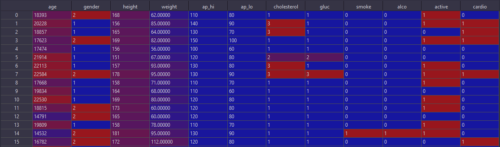

# Assignment 2

### Q2

#### Data Set Sample After Removing Unnecessary  ID Column and taking first 10000 records



```python
df = df.drop("id",axis=1)[:10000]
```
* Data set has 11 features and 10,000 records

#### Decision Tree 


* Function to calculate set entropy
```python
def entropy(vector):

    categories = vector.value_counts().to_numpy()
    total = np.sum(categories)
    ps = [p/total for p in categories]

    return -np.sum([p * np.log2(p) for p in ps if p > 0])
```
* TreeNode class to represent nodes in the tree
   * A tree node  asks a question about a feature whether it's value is below or above
a certain threshold and holds children nodes

  * more over a leaf node doesn't have children but holds a value to make a decision
 

 ```python
class TreeNode:

# Class Constructor

    def __init__(self, feature=None, right_child=None, left_child=None, threshold=None,value=None):

        self.feature = feature
        self.right_child = right_child
        self.left_child = left_child
        self.threshold = threshold
        self.value = value

# function to check if a node is leaf node or not
    def check_leaf_node(self):
        return self.value is not None
```


* Tree Class

  * Holds functions to build the tree recursively and classify input test set 
  * Class constructor takes maximum tree depth and number of decisions or classification categories with 20 , 2 as initial values respectively
```python
class DTree:

    def __init__(self, max_tree_depth=20, splits_min=2):

        self.root = None

        self.splits_min = splits_min
        self.max_depth = max_tree_depth
```

* Class Functions

```python

    def build_tree(self, features_matrix, labels_vector):

        self.root = self.grow(features_matrix, labels_vector)

```
```
Takes Features Matrix and Labels Vector of Training Set as inputs 
Initializes the root node and starts building the tree
```
```python
    def grow(self, features_matrix, labels_vector,depth=0):

        records_num = len(features_matrix)
        features_num = len(features_matrix.columns)
        labels_count = len(labels_vector.unique())

        # Stop when there is a leaf node

        if depth >= self.max_depth or labels_count < 2 or records_num < self.splits_min:

            leaf_node_value = self.get_common_label(labels_vector)

            return TreeNode(value=leaf_node_value)


        best_feature, best_threshold = self.get_best(features_matrix,labels_vector)
        left_indices, right_indices = self.branch(features_matrix[best_feature],best_threshold)
        features_matrix = features_matrix.drop(best_feature,axis=1)
        left_branch = self.grow(features_matrix.loc[left_indices], labels_vector[left_indices], depth+1)
        right_branch = self.grow(features_matrix.loc[right_indices], labels_vector[right_indices], depth+1)

        return TreeNode(best_feature,right_branch,left_branch,best_threshold,None)
```
```
Starts growing the treet node by node recursively
Handle leaf Nodes by Stopping Conditions and sets the node value to the most common label or desicion in the data
by calling class function get_common_label() 

Handles numerical Feature values by searching for best threshold in each Feature (Greedy Search) to split the data
by Calling class function get_best()

Get indices of each branch of the splitted data by calling class function branch()

Starts growing Nodes in each branch of the tree by calling it self recursively till maximum depth value is reached 
```

```python
    def get_common_label(self, labels_vector):

        categories_count = dict(labels_vector.value_counts())
        common_label = max(categories_count.items(), key=operator.itemgetter(1))[0]

        return common_label
```
```
Returns most frequent label or decision in the training data set
```

```python
    def get_best(self, features_matrix, labels_vector):

        best_gain = -1
        split_feature, split_threshold = None, None

        for feature_vector in features_matrix.columns:
            vector = features_matrix[feature_vector]
            thresholds = vector.unique()
            for t in thresholds:
                gain = self.calculate_information_gain(vector,labels_vector,t)

                if gain > best_gain:
                    best_gain = gain
                    split_feature = feature_vector
                    split_threshold = t

        return split_feature, split_threshold
```
```
Returns best feature that splits the data by certain threshold and returns its value 
based on information Gain value calculations calling class function calculate_information_gain()
```

```python
    def calculate_information_gain(self,feature_vector,labels,splitting_threshold):

        parent_entropy = entropy(labels)

        left, right = self.branch(feature_vector,splitting_threshold)

        total = len(labels)
        left_count = len(left)
        right_count = len(right)

        if left_count == 0 or right_count == 0 :
            return 0

        left_entropy = entropy(labels[left])
        right_entropy = entropy(labels[right])

        child_entropy = (left_count / total) * left_entropy + (right_count / total) * right_entropy

        return parent_entropy - child_entropy
```

```
Calculates information gain of a split based on a feature 
```

```python
    def branch(self,fv,threshold):

        left = fv[fv <= threshold ].index.to_list()
        right = fv[fv > threshold ].index.to_list()

        return left,right
```
```
Returns indicies of left and right records or branches resulting from a split based on a certin feature 
```

```python
    def prediction(self, records):

        predictions = []

        for index, row in records.iterrows():

            record = pd.DataFrame(columns=records.columns)

            record.loc[index] = row

            value = self.traverse_tree(record, self.root)

            predictions.append(value)

            del record

        return np.array(predictions)
```

```
Returns pridicted classification array for input test set records
by calling class function traverse_tree()
```

```python
    def traverse_tree(self,record, node):

        if node.check_leaf_node():

            return node.value

        if record[node.feature].values[0] <= node.threshold:

            return self.traverse_tree(record, node.left_child)

        return self.traverse_tree(record, node.right_child)
```
```
traverse a record or testing sample throw the tree nodes recursively starting from the root node thow branches till it is classifed reaching a leaf node 
```

#### Accuracy of The Tree
```python
def accuracy(y_true, y_pred):
    accuracy = np.sum(y_true == y_pred) / len(y_true)
    return accuracy * 100
```

#### Data Set Splitting

The ```StratifiedShuffleSplit()``` function is used for splitting the data set into train and test sets with test_set representing 10% 
```python
from sklearn.model_selection import StratifiedShuffleSplit
splitter = StratifiedShuffleSplit(n_splits=2,test_size=0.1, random_state=42)
```
[Function Documentation](https://scikit-learn.org/stable/modules/cross_validation.html#cross-validation-iterators)
* The ```ShuffleSplit()``` iterator will generate a user defined number of independent train / test dataset splits.
Samples are first shuffled and then split into a pair of train and test sets.

* It is possible to control the randomness for reproducibility of the results by explicitly seeding the random_state pseudo random number generator.

* ```StratifiedShuffleSplit()``` is a variation of ```ShuffleSplit()```, which returns stratified splits, i.e which creates splits by preserving the same percentage for each target class as in the complete set.


#### Cross Validation
```
The data set is split into 2 subsets and each subset has the same percentage of each category  
as in the original set , each subset is then split into training set and test set with size 10%
 
The accuracy of each subset is calculated and then the average accuracy of the tree is calculated which is equal 70.55 %
```
