# Assignment 1

### Iris Data set

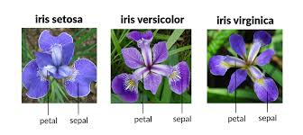

##### Data set information 
Sample|Info 
---|---
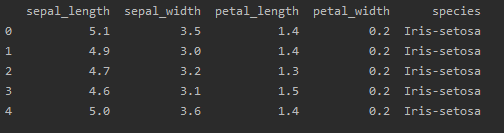|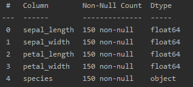

* The data set consists of  **150** raws **X** **5** Columns:
  * 150 raws representing different records
  * 4 Columns representing 4 features: 
    * **sepal_length** 
    * **sepal_width** 
    * **petal_length** 
    * **petal_width** 
  * Last Column representing classification or species of each record
    * There are 3 species:
      * **Iris-setosa**
      * **Iris-versicolor**
      * **Iris-virginica**
  
##### Features Scatter plot

Features | plot
---------|------
Sepal_length vs Sepal_width|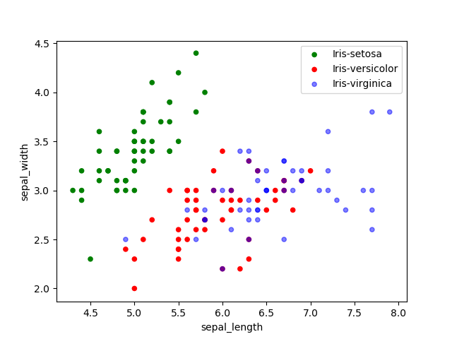
Petal_length vs Petal_width|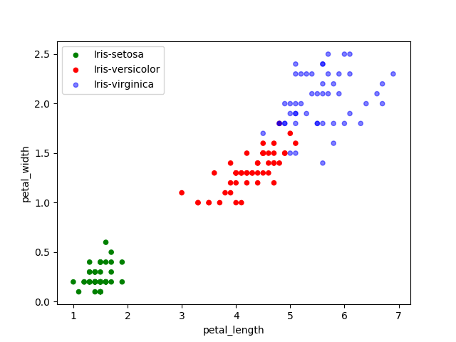

##### Histograms
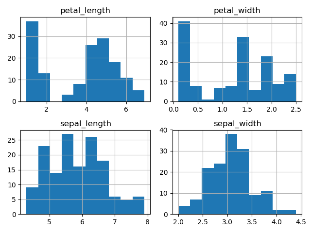

##### Features Statistics
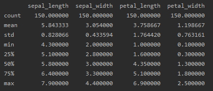

##### Features Correlation Matrix
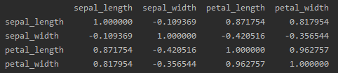

##### All Features Plot
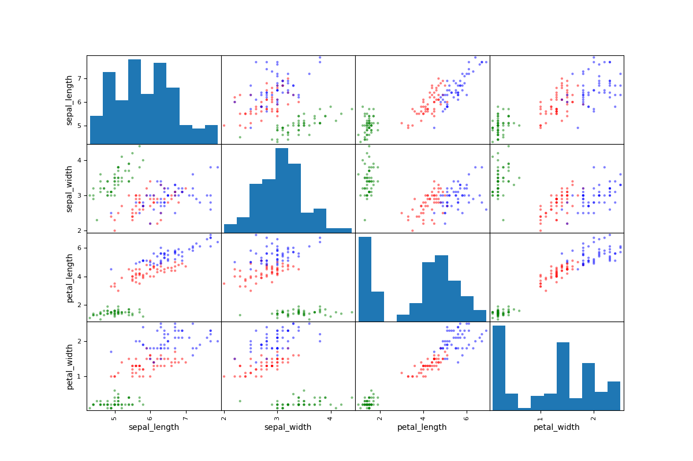

#### Data Set Splitting
The ```StratifiedShuffleSplit()``` function is used for splitting the data set into train and test sets
```python
from sklearn.model_selection import StratifiedShuffleSplit
splitter = StratifiedShuffleSplit(n_splits=5,test_size=0.2, random_state=42)
```
[Function Documentation](https://scikit-learn.org/stable/modules/cross_validation.html#cross-validation-iterators)
* The ```ShuffleSplit()``` iterator will generate a user defined number of independent train / test dataset splits.
Samples are first shuffled and then split into a pair of train and test sets.

* It is possible to control the randomness for reproducibility of the results by explicitly seeding the random_state pseudo random number generator.

* ```StratifiedShuffleSplit()``` is a variation of ```ShuffleSplit()```, which returns stratified splits, i.e which creates splits by preserving the same percentage for each target class as in the complete set.


#### Cross Validation

The data set is split into 5 subsets and each subset has the same percentage of each flower species
as in the original set , each subset is then split into training set and test set with size 20%
 
The accuracy of each subset is calculated and then the average accuracy of the system is calculated

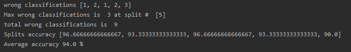


##### Adding New Features
I tried to generate new features that replaces the old features but it appeared that they didn't make any outstanding difference.

Features | plot|Result
---------|------|-----
length_ratio = (sepal_length / petal_length) vs width_ratio = (sepal_width / petal_width) |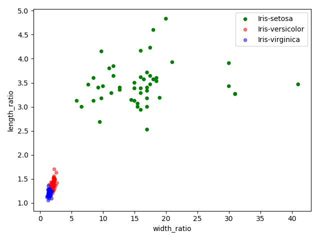|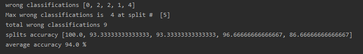
sepal_area = (sepal_length * sepal_width) vs petal_area = (petal_length * petal_width) |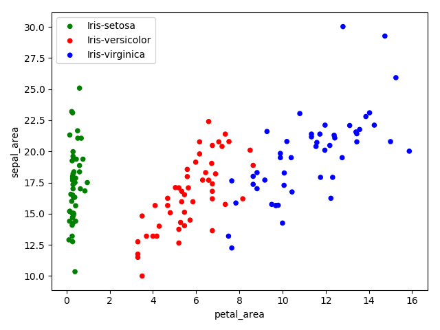|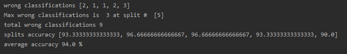
sepal_ratio = (sepal_length / sepal_width) vs petal_ratio = (petal_length / petal_width) |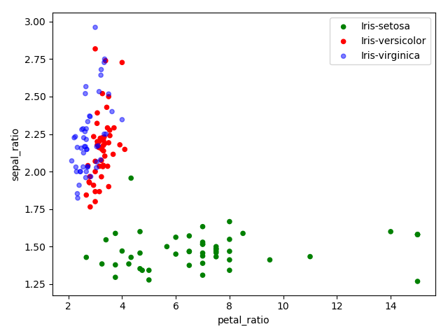|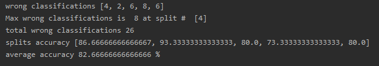
