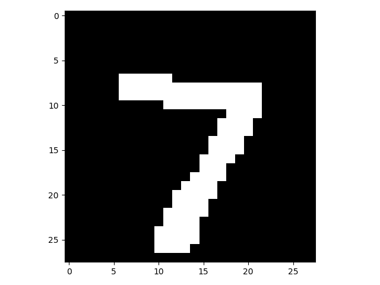
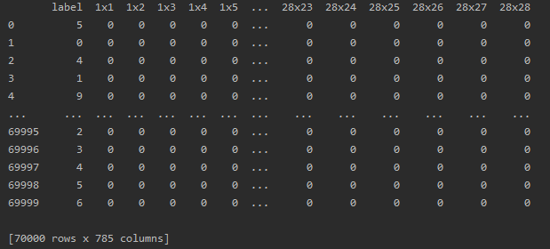
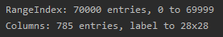
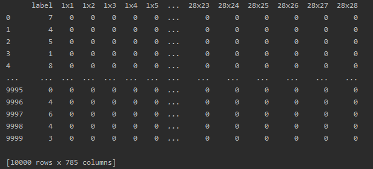
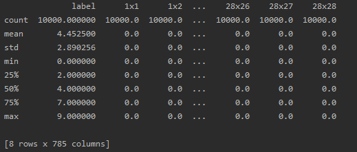
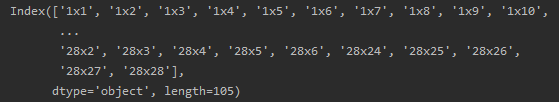
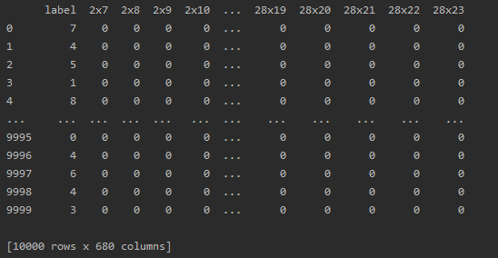
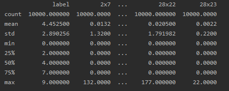
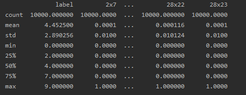

# Assignment 3

##### Dataset and pre-processing

* The data set contains 70,000 records of  gray-scale images of hand-drawn digits, from 0 to 9 .


* With total of 785 columns.
  * The first column, called "label", is the digit that was drawn by the user.
  * The rest of the columns contain the pixel-values of the associated image.
    * where each image is 28 pixels in height and 28 pixels in width, for a total of 784 pixels , 
    This pixel value is an integer between 0 and 255
    
* Sample record
```python
record = data.drop("label",axis=1).iloc[60000].to_numpy().reshape(28,28)
plt.imshow(record , cmap='gray',vmin=0,vmax=1)
plt.show()
```    
|Index|Image|
|----|----|
|Record at index 60,000||

* DataSet




* Classes


* The data is large so we can take a sample of 10000 records while maintaining the same
class distribution

* Sample Dataset



* Classes


* Features



* We notice that there are columns in the data set that have 0 standard deviation value
which means that all the records have the same value at this column , so these columns
can be dropped



* Resulting data set



* Features




* Then the feature values are minmax scaled from 0 to 1 using
```python
from sklearn import preprocessing
preprocessing.MinMaxScaler()
```



* Then the dataset is split into training and testing sets each 
has the same percentage of each class , With testing set size = 0.1 %

```python
from sklearn.model_selection import StratifiedShuffleSplit
splitter = StratifiedShuffleSplit(n_splits=1, test_size=0.1, random_state=42)
```

## Classifiers

|Classifier|Accuracy|
|----------|--------|
|```nv1 = naive_bayes.GaussianNB() ```| 56 %|
|```dt1 = tree.DecisionTreeClassifier() ```| 79.5 %|
|```svm1 = svm.LinearSVC(C=1, random_state=42, max_iter=10000) ```| 87.4 %|

* The LinearSVC uses one vs rest by default as multi class strategy as mentioned in the [Documentation](https://scikit-learn.org/stable/modules/generated/sklearn.svm.LinearSVC.html#sklearn.svm.LinearSVC)

* The 3 classifiers are fed to the voting classifier and then bagging and pasting are used
```python
v1 = ensemble.VotingClassifier(
estimators=[('nv', nv1), ('dt', dt1), ('svm',svm1)],
voting='hard')
```
* In bagging and pasting number of samples to draw are 0.3 % of the data size 
```python
bagging = ensemble.BaggingClassifier(
v1,
n_estimators=50,
max_samples=0.3,
bootstrap=True
)
```
|Classifier|Accuracy|
|----------|--------|
|Voting Classifier| 84.6 %|
|Bagging Classifier| 85.4 %|
|Pasting Classifier| 85.2 %|


